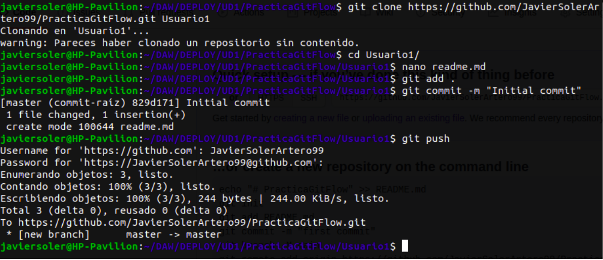
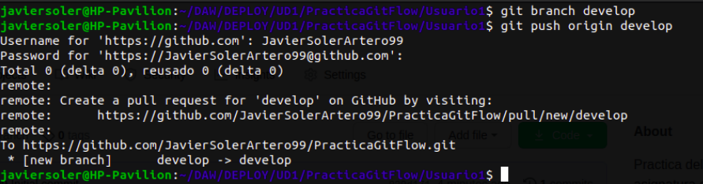
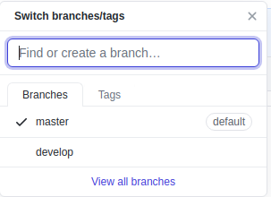

Practica GitFlow
Creacion del repositorio:

Se ha creado el repositorio en github y se le ha hecho un push para el commit inicial. 

Creando las la nueva rama develop y publicandola en el repositorio remoto.
