# Practica GitFlow

## Ejercicio 1:
### Primeros pasos del usuario 1:
Creación del repositorio y estructura inicial del proyecto. 

Se ha creado el repositorio en github y se le ha hecho un push para el commit inicial. 

Creando la nueva rama develop y publicandola en el repositorio remoto.

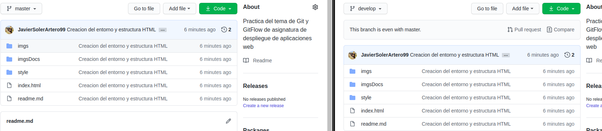
El usuario 1 ha subido las primeras modificaciones (estructura inicial del HTML y unos cuantos estilos) al repositorio remoro, tanto a la rama master como a la rama develop.

## Ejercicio 2:
### Features del Usuario 2:

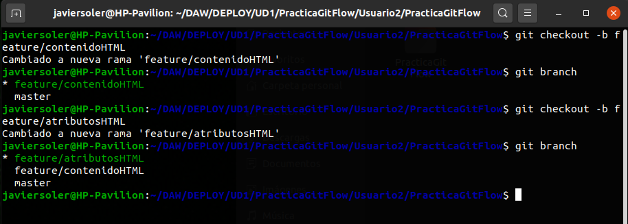
Como se puede observar en la captura el usuario 2 ha creado las dos nuevas features en el repositorio local.

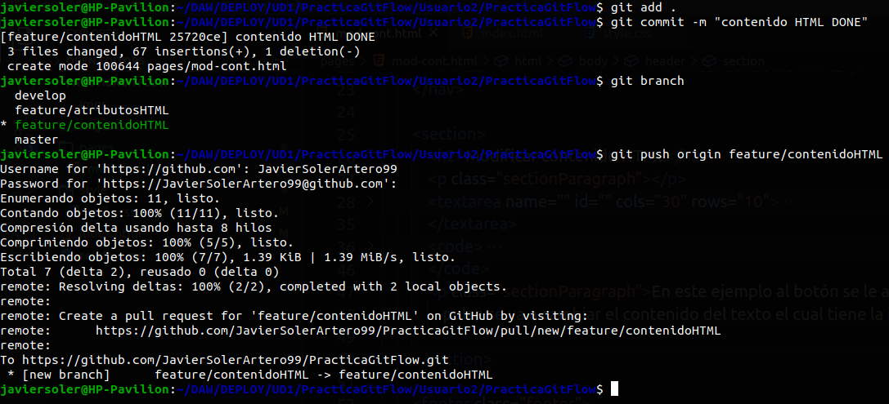
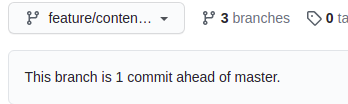

A continuación se ha creado el nuevo feature y se ha subido esta rama al repositorio remoto.

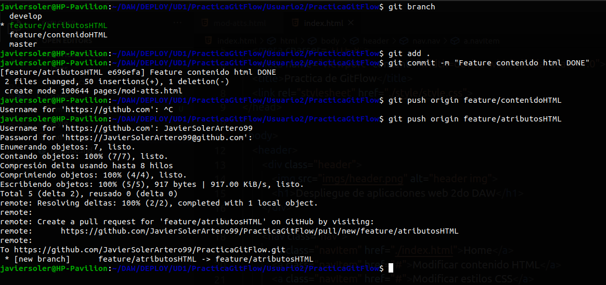
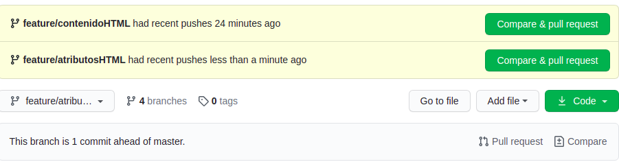

Se ha completado el feature de modificar atributos html y este se ha subido al repositorio remoto.

## Ejercicio 3:
### Features del Usuario 3:

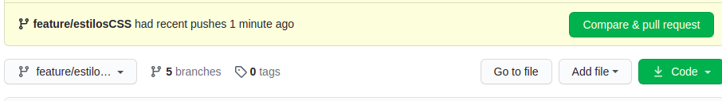
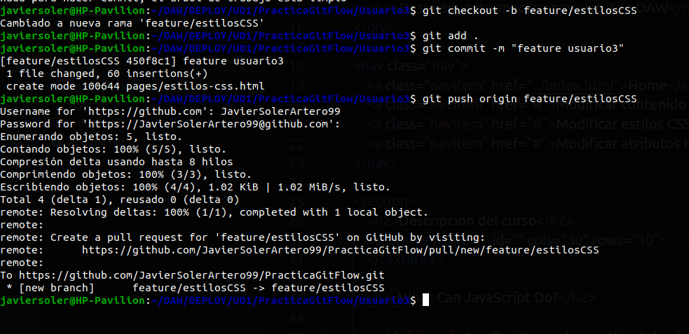

El usuario 3 ha creado y subido su feature al repositorio remoto.

### Release:

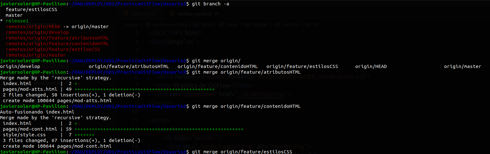
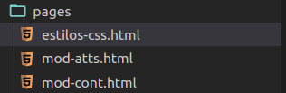

Se han traido los cambios de las ramas remotas y se han integrado en la rama de release para tener una versión. Como se puede observar en la segunda imagen, se han traido todos los archivos que se habian creado en las ramas remotas.

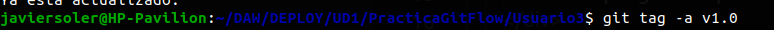

Se ha creado el nuevo tag en la rama de la release que ha hecho el usuario 3.

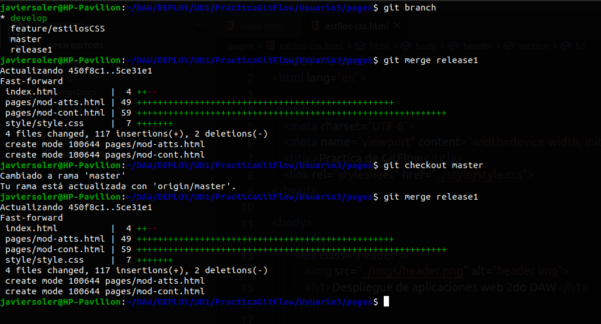

Publicando los cambios en las ramas master y develop.

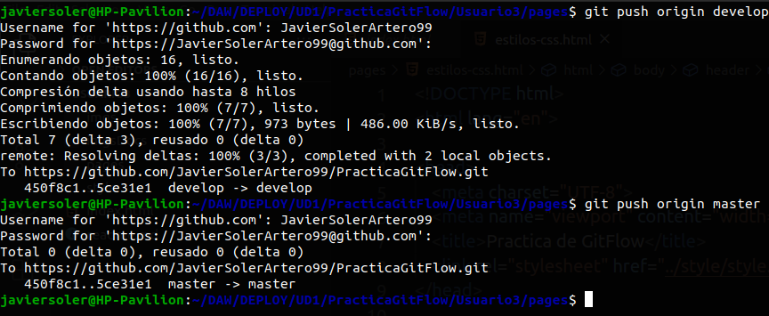
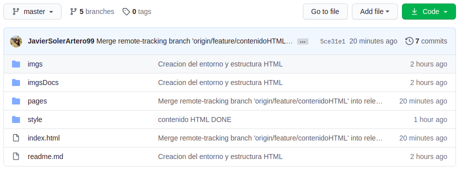
Rama Master remota
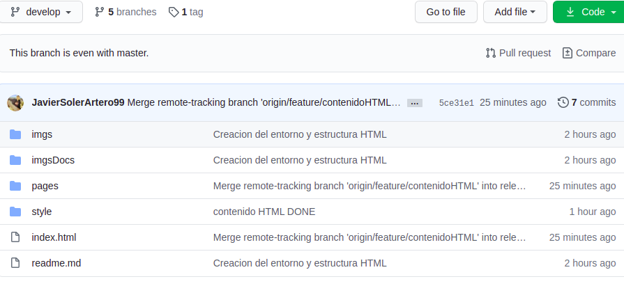
Rama Develop remota

Publicando los cambios en las ramas remotas

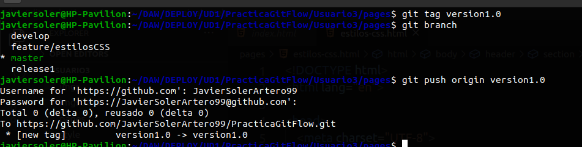

Subida del tag a la rama master remota.

## Hotfix

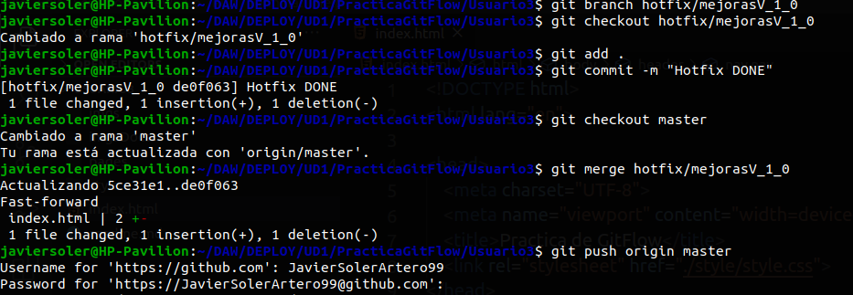

Se ha solucionado el hotfix y este se ha subido a la rama master del remoto y a la rama develop para que estos dos tengan el bug solucionado